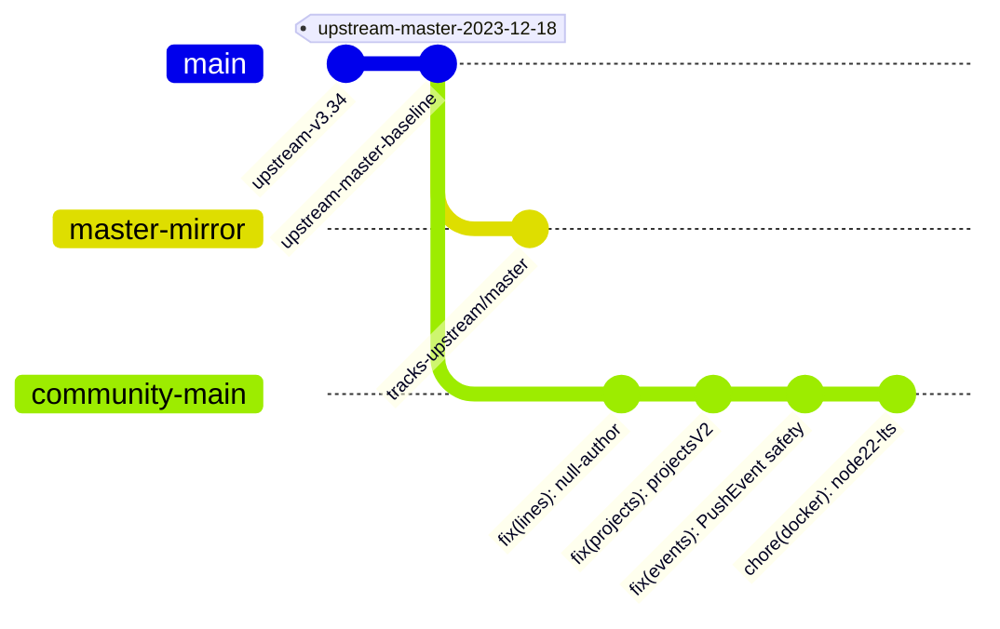

# Upstream Baseline and Synchronization Strategy

## 1. Upstream Information
- **Original Repository**: [lowlighter/metrics](https://github.com/lowlighter/metrics)
- **Original Author**: [@lowlighter](https://github.com/lowlighter) and community contributors
- **Original License**: MIT License (Copyright (c) 2020-present lowlighter)
- **Baseline Commit**: `366f8b9dfe3a59656c67d5dcad9950f59c9bc96d` (Tagged as `upstream-master-2023-12-18`)
- **Baseline Release**: `v3.34` (with `package.json` at `3.35.0-beta`)

---

## 2. Fork Nature & Scope
`yuanweize/metrics-community` is an **independent, community-maintained fork** established to resolve critical unmerged compatibility breakages, address security advisories, and provide an actively maintained GitHub Action for the developer community.

> [!NOTE]
> This repository is not an official successor to `lowlighter/metrics` and is not officially affiliated with or endorsed by the original maintainer. Original copyrights and contributor attributions are strictly preserved.

---

## 3. Dual-Track Branching Model

To ensure seamless long-term maintenance and compatibility with future upstream activities:

1. **`master` (Upstream Mirror Branch)**:
   - Dedicated strictly to mirroring `upstream/master`.
   - No community-specific commits are placed on `master`.
   - Used for detecting divergence and generating clean diffs against upstream.

2. **`main` (Community Maintained Branch)**:
   - Default branch of `yuanweize/metrics-community`.
   - Contains vetted fixes, security updates, and enhancements.
   - Recommended entrypoint for GitHub Action workflows: `uses: yuanweize/metrics-community@main` (or stable version tags).

3. **Topic Branches (`fix/*`, `chore/*`, `feat/*`)**:
   - Every fix or upstream port is developed in an isolated topic branch with dedicated regression tests before merging into `main`.

---

## 4. Automated Synchronization Policy

The repository runs an automated upstream check workflow (`.github/workflows/upstream-sync.yml`):
- Fetches `upstream/master`.
- Fast-forwards `master` mirror if upstream has new commits.
- If upstream commits exist, automatically opens an upstream synchronization PR against `main` for automated CI testing and review.
- Never force-pushes or silently overwrites maintained changes.
