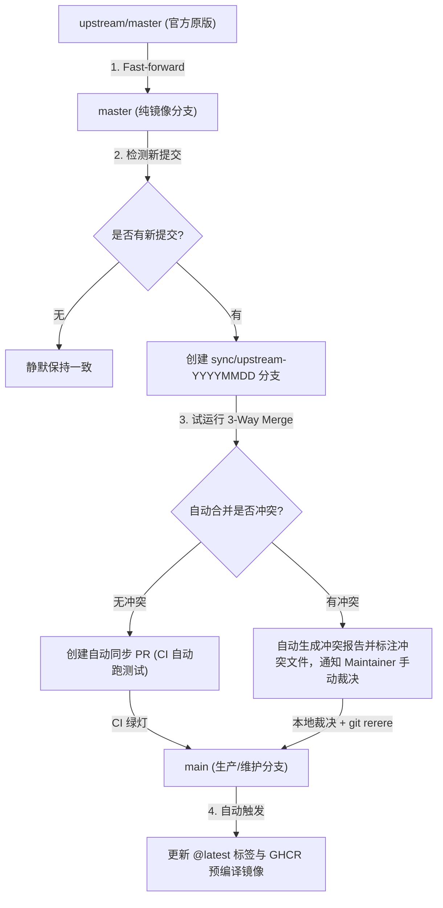

# 🔄 Upstream Baseline & Non-Conflicting Synchronization Strategy

本文件记录 `yuanweize/metrics-community` 对官方上游 `lowlighter/metrics` 的代码基线、自动化无冲突同步策略及冲突防御架构。

---

## 1. 上游基线信息 (Upstream Baseline)

- **官方上游仓库**: [lowlighter/metrics](https://github.com/lowlighter/metrics)
- **原作者**: [@lowlighter](https://github.com/lowlighter) 及开源社区贡献者
- **开源协议**: MIT License
- **分叉基线 Commit**: `366f8b9dfe3a59656c67d5dcad9950f59c9bc96d` (`upstream-master-2023-12-18`)
- **社区分叉定位**: 独立的社区维护版（Independent Community-Maintained Fork），致力于生态兼容修复、环境现代化与安全更新。所有原作者署名与版权严格保留。

---

## 2. “零冲突 / 隔离防护” 同步架构 (4-Pillar Conflict Prevention)

社区版修改了多个插件的核心代码（如 Lines、Steam、Music、Projects 等）。为了在日后持续同步上游潜在更新时**不发生冲突、不覆盖社区补丁、不破坏 main 分支**，我们建立了 4 层防线：



### 第一道防线：纯镜像分支隔离 (`master` 分支)
- 仓库中的 `master` 分支**严格且唯一**用于 fast-forward 镜像上游的 `upstream/master`。
- 绝不在 `master` 上提交任何社区自定义代码。这保证了我们随时拥有一个纯净、无任何污染的上游基准，方便 `git diff` 比对。

### 第二道防线：独立的自动化同步试水分支 (`sync/upstream-YYYYMMDD`)
- 每周一自动化工作流（[.github/workflows/upstream-sync.yml](.github/workflows/upstream-sync.yml)）触发或手动执行 `workflow_dispatch`。
- 如果上游有新提交，系统**绝不直接合入生产 `main` 分支**，而是从 `main` 切出一个隔离分支 `sync/upstream-YYYYMMDD` 执行 3-way 自动化合并测试：
  - **无冲突（Clean）**：自动创建 PR，触发完整的 CI 测试套件（含 Jest 单元测试与回归测试）。
  - **有冲突（Conflict）**：工作流捕获冲突文件列表，生成详细的 Conflict Issue/PR 提醒维护者介入，同时维持当前生产 `main` 绝对稳定安全。

### 第三道防线：反哺上游形成合并闭环 (Upstream PR Back-porting)
- 为什么社区补丁与上游未来更新能做到天然零冲突？
- 因为我们已经将关键修复（例如 Lines 修复 #1843、Music 修复 #1844、Steam 修复 #1845）以标准 PR 提交给官方上游。
- 一旦官方上游采纳并合并了这些 PR，双方在 Git 树上拥有了共同的提交历史（Common Tree），后续 Git 在 3-way 合并时会自动识别为已合入代码，**真正达成 0 冲突自动合并**！

### 第四道防线：启用 Git Rerere 记录冲突解决方案 (Reuse Recorded Resolution)
- CI 与维护者本地均配置：
  ```bash
  git config --global rerere.enabled true
  ```
- 任何曾经解决过一次的文件冲突，Git 会自动在 `.git/rr-cache` 中持久化记录处理结果。当下一次上游发生关联变动时，Git 会自动重放该解决方案，无需重复人工介入。

---

## 3. 本地手动同步操作手册 (Maintainer Manual Sync Guide)

如果你希望在本地手动拉取并同步上游，请使用标准命令：

```bash
# 1. 抓取最新上游代码
git fetch upstream master

# 2. 保证 master 纯镜像分支同步
git checkout master
git merge --ff-only upstream/master
git push origin master

# 3. 切回社区维护分支并进行合并
git checkout main
git merge upstream/master

# 4. 如果遇到冲突，运行测试并裁决
npm test
git commit -m "chore(sync): sync upstream/master into community main"
git push origin main
```

每次合并推送到 `main` 后，系统的 GitHub Actions 会自动更新 `@latest` 标签，并自动打包推送多架构容器到 GHCR。
